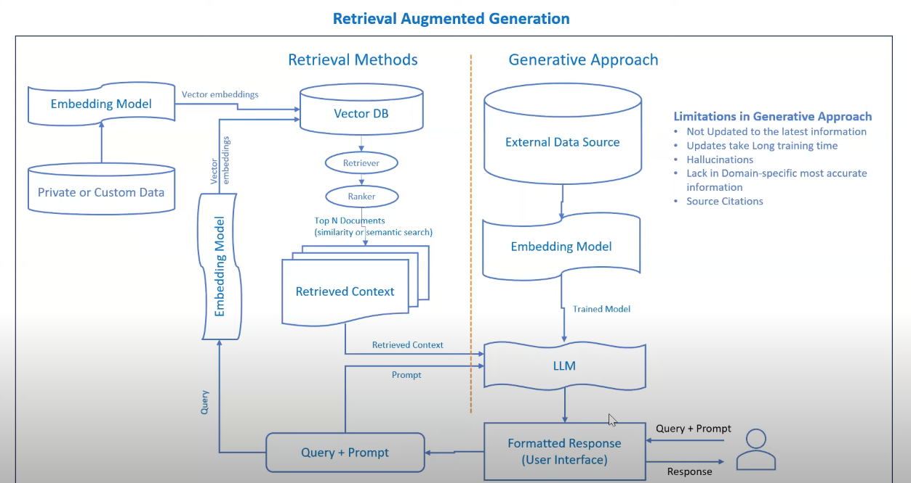

# HRBuddy

HRBuddy is an open-source tool designed to assist users with their HR-related queries by leveraging the company's internal HR policies. It utilizes a Retrieval Augmented Generation (RAG) system architecture to provide efficient and accurate responses to user queries.



## Key Features

- Retrieves information from the company's internal HR policies.
- Generates relevant and personalized responses to user queries.
- Utilizes state-of-the-art natural language processing techniques.
- Provides a user-friendly interface for easy interaction.

## Setup and Installation

To set up and run HRBuddy locally, follow these steps:

1. Clone the repository:
```
git clone https://github.com/your_username/HRBuddy.git
```


2. Navigate to the project directory:
```
cd HRBuddy
```


3. Set up a virtual environment using Poetry:
```
poetry shell
```

4. Install dependencies:
```
poetry install
```


5. Start JupyterLab:
```
jupyter lab
```


6. Open a web browser and navigate to the provided URL to access HRBuddy.

## Usage

Once HRBuddy is set up and running, users can interact with it by following these steps:

1. Enter your HR-related query into the provided interface.
2. HRBuddy will process your query and retrieve relevant information from the company's HR policies.
3. The system will generate a response based on the retrieved information and present it to the user.

## Contributing

Contributions to HRBuddy are welcome! If you'd like to contribute to the project, please follow these guidelines:

- Fork the repository and create a new branch for your feature or bug fix.
- Make your changes and ensure that they are properly tested.
- Submit a pull request detailing your changes and explaining their purpose.

## License

HRBuddy is licensed under the MIT License. See the [LICENSE](LICENSE) file for more information.

## Contact.
Want to discuss anything you can reach me out [here](https://linktr.ee/jindalAnuj)
